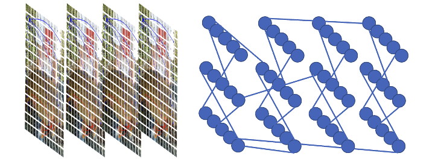
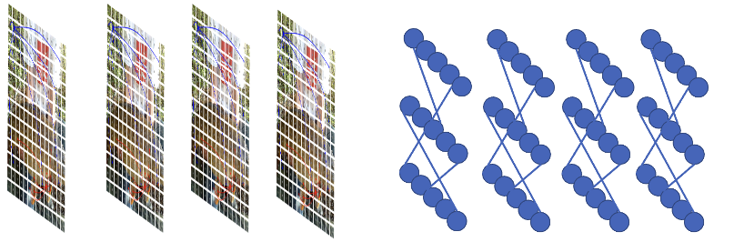

# Video GNN revised from Vision GNN:
By Kai Han, Yunhe Wang, Jianyuan Guo, Yehui Tang and Enhua Wu. NeurIPS 2022. [[arXiv link]](https://arxiv.org/abs/2206.00272)


## Requirements
Pytorch 1.7.0,
timm 0.3.2,
torchprofile 0.0.4,
apex,
tensorboardX,
decord,
einops

## Training

- Training VideoGNN using 2 GPUs on [HMDB51](https://serre-lab.clps.brown.edu/resource/hmdb-a-large-human-motion-database/#Downloads):
- Download HMDB51 dataset first from the official website
- Move train/test.csv from "data" to the dataset
```
python -m torch.distributed.launch --nproc_per_node=2 --master_port=2342 train.py --model vig_ti_224_gelu --sched cosine --epochs 110 --opt adamw -j 8 --warmup-lr 1e-6 --model-ema --model-ema-decay 0.99996 --warmup-epochs 10 --decay-epochs 20 --opt-eps 1e-8 --repeated-aug --remode pixel --reprob 0.25 --amp --lr 2e-3 --weight-decay .05 --drop 0 --drop-path .1 -b 12 --output ./train_exp --gpu-ids 0,1
```

## Our Improvements

- Method 1: Whole Graph Construction

In this method, the time, height, and width dimensions of the input data are merged, resulting in the construction of a graph where data from all time steps are included in the same graph. This approach considers both time and spatial dimensions, but they are processed within a single adjacency matrix. In other words, this method fuses the spatial information of the entire time sequence into one adjacency matrix.



- Method 2: Separate Time Step Graph Construction

In this method, the batch and time dimensions of the input data are merged, meaning that when constructing the graph, each time step has its own independent graph. This processing approach allows for handling data along the time dimension, where each time step has its own adjacency matrix. This method considers spatial information separately for each time step when dealing with data that has a time dimension (such as video).



## Performance

k is the number of nearest nodes, default 9. T is the time steps we keep before consturcting the graph.

- Baseline Performance: top-1 accuracy is 33.922 for training 120 epoches. Parameters: 7.8M, FLOPs: 47.6B.
- Method 2, T = 4, Performance: top-1 accuracy is 36.286 for training 120 epoches. Parameters: 34.9M, FLOPs: 9.8B.
- Method 2, T = 16, Performance: top-1 accuracy is 38.929 for training 120 epoches. Parameters: 63M, FLOPs: 27B.
- Method 1, T = 4, k = 36, Performance: top-1 accuracy is 30.221 for training 120 epoches. Parameters: 34.9M, FLOPs: 10.8B.

As can be seen from the table, our methods achieve better results than the baseline with less computation.


## Acknowledgement
This repo partially uses code from [Vision GNN](https://github.com/huawei-noah/Efficient-AI-Backbones).

## Citation
```
@inproceedings{han2022vig,
  title={Vision GNN: An Image is Worth Graph of Nodes}, 
  author={Kai Han and Yunhe Wang and Jianyuan Guo and Yehui Tang and Enhua Wu},
  booktitle={NeurIPS},
  year={2022}
}
```
